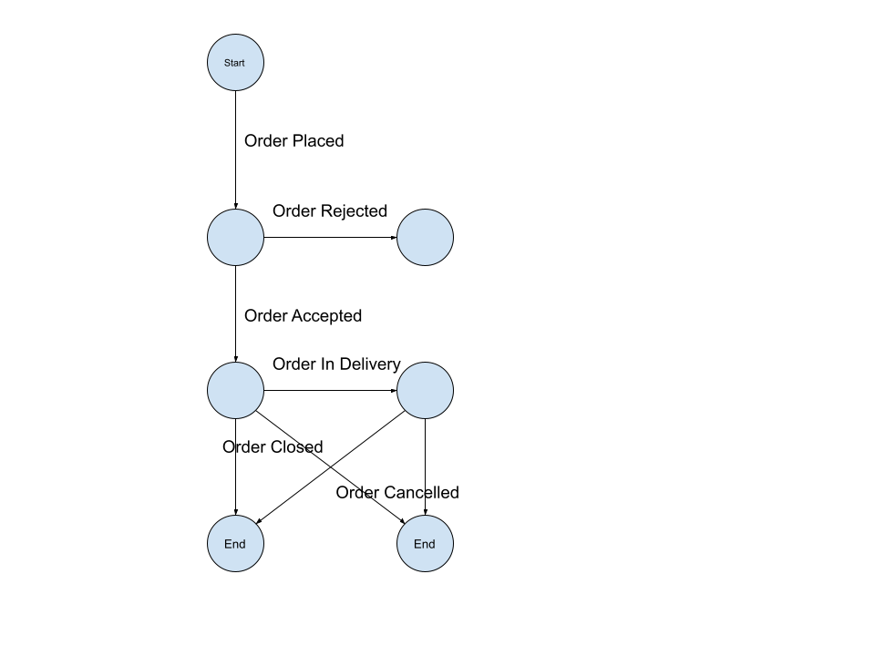

# Restaumatic External Orders API

The goal of the API is to separate, isolate and outsource the concern of handling specifics of external order sources (including but not restricting to portals) to the external parties called *External Orders Proxies*.

Restaumatic External Orders API is bidirectional API between Restaumatic and External Orders Proxies. Restaumatic system running in the cloud exposes endpoint hooks and calls the endpoints hooks of an External Orders Proxy according to the messaging flow specified below.

Use case:
  1. Order is created in one of many food online ordering parties for the restaurant that is powered by Restaumatic system
  2. External Orders Proxy fetches incoming orders from ordering party for Restaumatic restaurants and places the order in Restaumatic via `Order Placed` (see the details in sections below) event
  3. Restaumatic responds to External Order Proxy with `Order Accepted` or `Order Rejected` events when applicable
  4. External Orders Proxy updated the order in external ordering party accordingly
  5. Restaumatic updates the progress of the order with `Order in Delivery` or `Order Closed` event
  6. External Orders Proxy updated the order in external ordering party accordingly

The allowed messaging are determined by the following conversation state diagram:



## Order Placed

> POST `[restaumatic base URL]/api/v1/external/orderplaced`

### Headers

- `'Content-type': 'application/json'`
- `'authorization': 'Token token="[API_TOKEN]"'` where `API_TOKEN` is External Order API client-specific credential, provided by Restaumatic when enabling the client

### Body

```
{
    "externalOrderId": "89a3bb4a-9257-11eb-a8b3-0242ac130100",
    "externalOrderSourceReferenceName": "yyummyy.comm",
    "externalOrderReferenceId": "100100",
    "shortExternalOrderReferenceId": "YYU100",
    "restaurantId": 466,
    "orderedAt": "2021-03-31T16:10:03Z",
    "subjectToReject": true,
    "subjectToAcceptBefore": "2021-03-31T16:20:03Z",
    "subjectToCancel": false,
    "fullfillmentMethod": {
      "tag": "Delivery",
      "address": {
        "street": "High Street",
        "streetNumber": "12",
        "apartmentNumber": "10",
        "floor": "2",
        "postCode": "12-345",
        "city": "London",
        "country": "GB",
        "formattedAddress": "High St. 12/10 second floor",
        "coordinates": {
          "lon": 20.02341,
          "lat": 50.46789
        }
      }
    },
    "requestedFullfillmentTime": "2021-03-31T17:30:00Z",
    "subjectToOverwriteFullfillmentTime": true,
    "paymentMethod": "Cash",
    "customer": {
      "fullName": "John Doe",
      "email": "john.doe@mymail.com",
      "phone": "+48123123123",
      "locale": "PL"
    },
    "customerOrderNote": "Please be on time",
    "vatId": "1234567890",
    "products": [
      {
        "name": "Chopped Pork + Potatos + Cabbage, XXL",
        "quantity": 1,
        "grossUnitPrice": 20.38,
        "vatRate": "B",
        "specifications": [
          {
            "name": "Replace potatoes with rice",
            "quantity": 1,
            "grossUnitPrice": 2.5,
            "vatRate": {
              "tag": "IncludedInProduct"
            }
          },
          {
            "name": "Extra fuzzy drink",
            "quantity": 1,
            "grossUnitPrice": 3.5,
            "vatRate": {
              "tag": "Separate",
              "contents": "A"
            }
          }
        ]
      }
    ],
    "discounts": [
      {
        "name": "Cheap Mondays",
        "description": "All 15% off",
        "value": 10.28
      }
    ],
    "tip": 2.00,
    "deliveryFee" : 5.00,
    "totalGrossPrice": 17.10
}
```

#### Description

**Idempotent** operation, based on `externalOrderId` parameter.

The event is rejected only if and only if not valid in terms of format, regardless of the state of the system.

  1. `externalOrderId` - required UUID, unique id of an order generated by the client. Repeated events with the same `externalOrderId` are considered duplicates and ignored. It is then safe to re-send the same events multiple times as they share the same externalOrderId and therefore duplicates will be accepted on http transport layer and ignored within logic of Restaumatic API. Consequently, a medium with at-least-once delivery guarantee can be used.
  1. `externalOrderSourceReferenceName` - required non-empty text. Name of the order source (e.g. portal) the order originates from. Allowed values should be agreed upon when setting up integration between the external order proxy and Restaumatic.
  3. `externalOrderReferenceId` - required non-empty text, unique (locally for `externalSourceReferenceName`) order id given by the source of the order. Display only.
  4. `shortExternalOrderReferenceId`, - optional non-empty text, unique (locally for `externalOrderReferenceId` and vaguagly for current time frame). Short id given by the source of an order, used for e.g. correlating order between restaurants, couriers and customers. Display only.
  5. `restaurantId` - required integer (64 bit), id of the restaurant in the system, most probably other than restaurant id in external order source
  6. `orderedAt` - required zulu (UTC) time in ISO 8601 format e.g. `2019-05-14T15:44:54.723Z`, what time the order was placed by a customer, if not known, the time the order was placed in External Order Proxy
  7. `subjectToReject` - required boolean. Tells if the order can be rejected.
      > currently supporting only `true` value
  8. `subjectToAcceptBefore` - optional zulu (UTC) time in ISO 8601 format e.g `2019-05-14T15:44:54.723Z`, till what time the order should be accepted. If not present, the order is assumed to be implicitly accepted.
      > currently required
  9. `fullfillmentMethod` - required object with required discriminator field `tag` taking value `Takeaway` or `Delivery` or `DineIn`. Tells how the restaurant is supposed to fulfill the order:
      1. `Takeaway` - an order must only be prepared in a restaurant, it will be taken away by customer
      1. `CourierPickUp` - an order must only be prepared in a restaurant, it will be taken away by external courier
      1. `Delivery` -  an order must only be prepared and delivered by a restaurant, for this tag additional field `address` is required with fields:
          1. `street` - required non-empty text
          2. `streetNumber` - required text, however can be empty
          3. `apartmentNumber` - optional non-empty text
          4. `floor` - optional non-empty text
          5. `postCode` - optional non-empty text
          6. `city` - required non-empty text
          7. `country` - required, one of PL, GB, RU, RO, CZ, HR, SK, DE, NL, ES (potentially extended in the future)
          8. `formattedAddress` - optional non-empty text, the address in the way it's supposed to be displayed, should be in accordance to other fields
          9. `coordinates` - optional object
              1. lat - required number, latitude
              2. lon - required number, longitude
      1. `DineIn` - an order must only be prepared and delivered to a restaurant table, could potentially include table number (e.g. via scanning qr code)
  10. `requestedFullfillmentTime` - optinal zulu (UTC) time in ISO 8601 format e.g "2019-05-14T15:44:54.723Z", when the restaurant is suppossed to fullfill the order, which is: either getting the order ready to be picked up by the external courier or customer (`fullfillmentMethod==Takeaway`) or getting the order delivered by the restaurant's courier (`fullfillmentMethod==Delivery`) or serving the order at the restaurant's table (`fullfillmentMethod==DineIn`). If not provided it's assumed to be as soon as possible.
  11. `subjectToOverwriteFullfillmentTime` - required boolean - if fullfilment time can be overwritten upon order acceptance
      > currently supporting only `true` value
  12. `paymentMethod` - required one of `Cash` or `Online` or `Card` or `Prepaid`.
  13. `customer` - required object
      1. `email` - optional not-empty email
      2. `fullName` - text, as full as provided by external order source
      3. `phone` - optional text
      4. `locale` - optional, locale as defined by ISO/IEC 15897, falls back to `en` if not provided
  14. `customerOrderNote` - optional non-empty text up to 512 characters, a note a customer can place on the order
  15. `vatId` - optional non-empty text, vat tax payer identifier to be used for fiscalization
  16. `products` - required non empty array of objects
      1. `name` - required, not-empty text
      1. `quantity`" - required positive integer
      1. `grossUnitPrice` - required positive number, should include `grossUnitPrice`s of specifications (see below)
      1. `vatRate` - optional text, letter ranging from A to G (as defined in regulation https://www.gov.pl/web/finanse/do-31-lipca-zmien-oznaczenia-w-kasach-rejestrujacych), if provided then the restaurant can print fiscal receipt for the order
      1. `specifications` - optional list of modifications of ordered product
          1. `name` - required, not-empty text, max 256 characters long
          1. `quantity`" - required positive integer
          1. `grossUnitPrice` - required non-negative number
          1. `specificationVatRate` - optional value with required discrimator field `tag` taking value `IncludedInProduct` or `Separate`. When `tag` is set to `Separate`, field `content` is also required and takes value being letter from A to G (See `vatRate` in product)
  17. `discounts` - optional, non-empty array of objects containing:
      1. `name` - required text, max 256 characters long
      1. `description` - required text, max 256 characters long
      1. `value` - required positive value
  18. `tip` - optional, positive value
  19. `deliveryFee` - required, delivery fee
  20. `totalGrossPrice` - required positive number, should be the sum of products' grossPrices minus sum of discounts

### Response

`HTTP 400` if invalid body, `HTTP 401` if the External Orders Proxy not authorized to place the order, `HTTP 200` otherwise.

## Order Accepted

> POST `[external orders proxy base URL]/orderAccepted`

### Headers

- `'Content-type': 'application/json'`
- `'authorization': 'Token token="[API_TOKEN]"'` where `API_TOKEN` is Restaumatic credential, provided by External Orders Proxy when enabling integration

### Body

```
{
    "externalOrderUUID": "89a3bb4a-9257-11eb-a8b3-0242ac130100",
    "externalOrderId": {
        "source": "yyummyy.comm",
        "externalId": "100100"
        "displayId": "YYU100",
    }
    "overwrittenDeliveryTime": "2020-06-10T13:20:00Z",
    "restaumaticOrderId": 4617289,
    "restaurantId": 12345,
}
```

#### Description

1. `externalOrderId` - required UUID, external order id as provided in Order Placed event
1. `restaumaticOrderId` - required text, order id in Restaumatic
1. `overwrittenFullfillmentTime` - optional zulu (UTC) time in ISO 8601 format e.g "2019-05-14T15:44:54.723Z", present if and only if the mentioned order was `subjectToOverwriteFullfillmentTime`.

### Response

`HTTP 400` if invalid body, `HTTP 401` if Restaumatic not authorized to accept the order, `HTTP 200` otherwise.

## Order Rejected

> POST `[external orders proxy base URL]/orderRejected`

### Headers

- `'Content-type': 'application/json'`
- `'authorization': 'Token token="[API_TOKEN]"'` where `API_TOKEN` is Restaumatic credential, provided by External Orders Proxy when enabling integration

### Body

```
{
    "externalOrderUUID": "89a3bb4a-9257-11eb-a8b3-0242ac130100",
    "externalOrderId": {
        "source": "yyummyy.comm",
        "externalId": "100100"
        "displayId": "YYU100",
    }
    "restaurantId": 12345,
}

```

#### Description

1. `externalOrderId` :: required UUID, external order id as provided in Order Placed event

### Response

`HTTP 400` if invalid body, `HTTP 401` if Restaumatic not authorized to reject the order, `HTTP 200` otherwise.


## Order in Delivery

> POST `[external order proxy base URL]/orderindelivery`

### Headers

- `'Content-type': 'application/json'`
- `'authorization': 'Token token="[API_TOKEN]"'` where `API_TOKEN` is Restaumatic credential, provided by External Orders Proxy when enabling integration

### Body

```
{
  "restaumaticOrderId": "362718"
}
```

#### Description

1. `restaumaticOrderId` - required text, order id in Restaumatic

### Response

`HTTP 400` if invalid body, `HTTP 401` if Restaumatic not authorized to update the order, `HTTP 200` otherwise.


## Order Closed

> POST `[external orders proxy base URL]/orderClosed`

### Headers
### Body

```
{
  "restaumaticOrderId": "362718"
}
```

#### Description

1. `restaumaticOrderId` - required text, order id in Restaumatic

### Response

`HTTP 400` if invalid body, `HTTP 401` if Restaumatic not authorized to close the order, `HTTP 200` otherwise.
